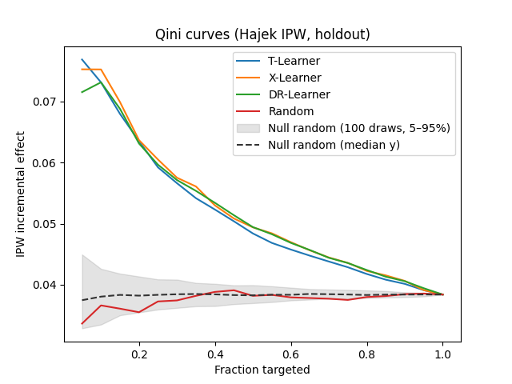
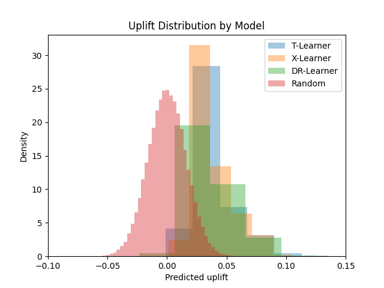
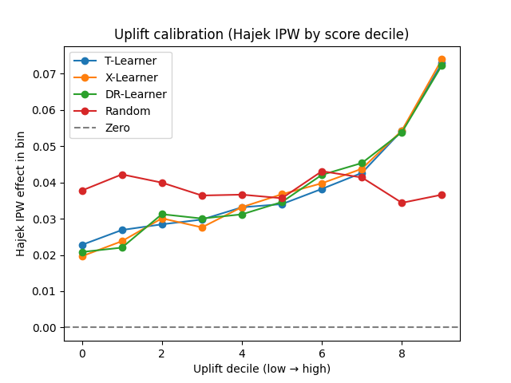

# Causal

This repository trains and evaluates **uplift / heterogeneous treatment effect** models on a simulated digital-ads-style dataset. Features include **intent** (Beta-distributed) and **context** (Gaussian); treatment assignment is **biased** with respect to intent, and conversion is binary. The simulator exposes the **true conditional average treatment effect (CATE)** \(\tau(X) = \texttt{CATE\_INTERCEPT} + \texttt{CATE\_INTENT\_SLOPE} \cdot \texttt{intent}\), which makes it possible to score models on both **observed (IPW-adjusted)** outcomes and **oracle** benchmarks.

## Purpose

- Compare **meta-learners** (T-, X-, DR-Learner) that predict per-unit uplift against a **random ranking** baseline.
- Report **ranking quality** (Qini-style curves and excess AUC vs random), **policy value** in the top-scored slice, **calibration** of predictions against Hajek IPW effects, and agreement with **true** \(\tau\) where available.
- Support reproducible **holdout Monte Carlo** evaluation (multiple train/test splits with stratified treatment).

## Models

| Model | Role |
|--------|------|
| **T-Learner** | Separate outcome models for treated and control; uplift is the difference in predicted conversion probabilities. |
| **X-Learner** | Two-stage approach using imputed treatment effects on treated and control arms, then combined for uplift. |
| **DR-Learner** | Doubly robust pseudo-outcome (propensity + outcome models, then regression on the DR target) for CATE. |
| **Random** | Baseline that uses random scores (Gaussian with \(\sigma\) matched to the scale of \(\tau\) under the Beta DGP) for ranking and Qini curves; used to define the **null** for Qini excess. |

## Metrics

- **Oracle policy value (true \(\tau\), top fraction):** Best achievable mean \(\tau\) in the top policy fraction using the true CATE—an upper bound for ranking by \(\tau\).
- **Qini raw:** Area under the **Hajek IPW** incremental-effect curve on the test set as the targeted fraction grows (higher is better).
- **Qini \(\Delta\):** Qini raw minus the **median** of 100 **random-ranking** Qini AUCs (null); averaged across holdout splits. Models are **ranked by Qini \(\Delta\)**.
- **Random baseline:** Qini raw is set to that null median; Qini \(\Delta\) is **0**. Policy and correlation use random Gaussian scores; the Qini curve uses the same scores.
- **Policy (IPW obs):** Hajek **observed** treatment effect in the top-scored slice (propensity \(\hat e(X)\) for IPW is fit on **train only**).
- **Policy (true \(\tau\)):** Mean **simulator** \(\tau\) in that same top-scored slice (not IPW-adjusted).
- **Regret (true \(\tau\)):** Shortfall of **Policy (true \(\tau\))** relative to the oracle policy value.
- **Avg uplift:** Mean predicted uplift on the test set.
- **Corr (true):** Correlation between predicted uplift and true \(\tau\) on the test set.

## Evaluation report (example run)

**Oracle policy value (true \(\tau\), top fraction):** 0.063  

**Holdout Monte Carlo:** 3 splits  

**Qini \(\Delta\):** Qini raw minus the median of 100 random-ranking AUCs (**0.036**, averaged across splits). Models ranked by Qini \(\Delta\).

| Rank | Model | Qini \(\Delta\) (vs null) | Qini raw | Policy (IPW obs) | Policy (true \(\tau\)) | Regret (true \(\tau\)) | Avg uplift | Corr (true) |
|------|--------|---------------------------|----------|------------------|------------------------|------------------------|------------|-------------|
| 1 | X-Learner | 0.013 | 0.049 | 0.064 | 0.063 | 0.000 | 0.038 | 0.929 |
| 2 | DR-Learner | 0.012 | 0.049 | 0.063 | 0.063 | 0.001 | 0.038 | 0.873 |
| 3 | T-Learner | 0.012 | 0.048 | 0.064 | 0.062 | 0.001 | 0.039 | 0.853 |
| 4 | Random | 0.000 | 0.036 | 0.035 | 0.039 | 0.025 | −0.000 | 0.001 |

**Takeaway:** X-, DR-, and T-Learners all lift Qini meaningfully above the random null and achieve policy value close to the oracle on true \(\tau\); the random baseline sits at the null Qini and shows high regret.

## Figures

**Qini curves (Hajek IPW, holdout)** — incremental IPW effect vs fraction targeted, with random null band and median.

<p align="center">
  
</p>

**Uplift distribution by model** — density of predicted uplift vs the random control.

<p align="center">
  
</p>

**Uplift calibration (Hajek IPW by score decile)** — observed effect in each predicted-uplift decile.

<p align="center">
  
</p>

## Running

```bash
python main.py
```

This fits learners, aggregates metrics across `MONTE_CARLO_SPLITS` holdouts (see `config.py`), and invokes the report/plotting utilities in `evaluation/report_generator.py`.
