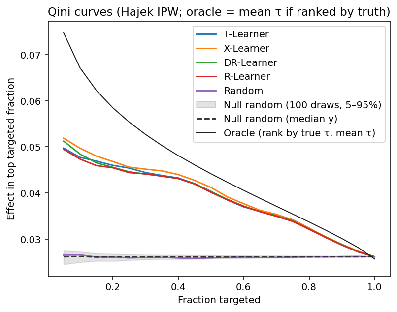
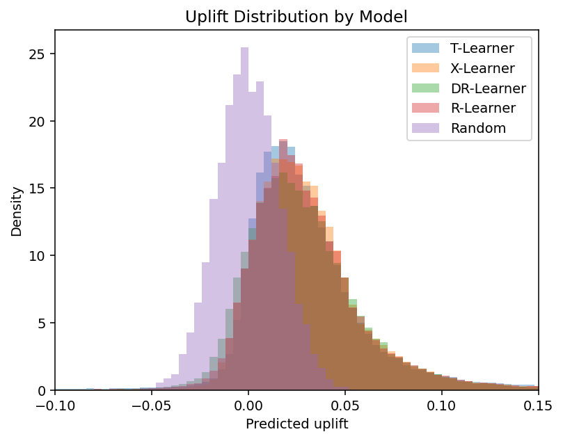
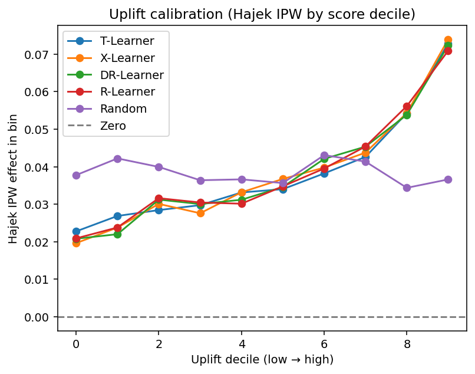

# Causal

This repository trains and evaluates **uplift / heterogeneous treatment effect** models on a simulated digital-ads-style dataset. Each user has **intent** (Beta-distributed) and **context** (Gaussian), a binary treatment `T`, and a binary conversion `Y` (`1` = converted). By default, treatment is assigned like an **RCT** (50/50, independent of features). Setting `TREATMENT_PROB_SLOPE > 0` in `config.py` switches to **biased** assignment that mimics targeted outreach.

The simulator defines a known per-user treatment effect **τ** (see [Simulation](#simulation)). That makes it possible to score models on **observed** outcomes (IPW-adjusted) and on **oracle** benchmarks that use the true τ.

## Purpose

- Compare **meta-learners** (T-, X-, DR-, R-Learner) that predict per-unit uplift against a **random ranking** baseline.
- Report **ranking quality** (Qini-style curves and excess AUC vs random), **policy value** in the top-scored slice, **calibration** of predictions against Hajek IPW effects, and agreement with **true** `τ` where available.
- Support reproducible **holdout Monte Carlo** evaluation (multiple train/test splits with stratified treatment).

## Simulation

Each user’s conversion probability is a **baseline** (without treatment) plus uplift when treated: `P(Y=1 | X, T) = clip(μ(X) + T·τ(X), 0, 1)`, with `Y ~ Bernoulli(P)`. Baseline conversion probability `μ(X)` depends on intent and context (`OUTCOME_*` in `config.py`). **Treatment assignment** depends on **intent only**; **τ(X)** can also use context, so who benefits most is not always aligned with who gets treated.

**True treatment effect** `τ(X)` — implemented in `config.cate`, what learners should recover:

```math
\begin{aligned}
\tau(X) ={} & \text{CATE\_INTERCEPT} \\
&+ \text{CATE\_INTENT\_SLOPE} \cdot \text{intent} \\
&+ \text{CATE\_CONTEXT\_SLOPE} \cdot \text{context} \\
&+ \text{CATE\_INTENT\_CONTEXT\_COEF} \cdot \text{intent} \cdot \text{context} \\
&+ \text{CATE\_CONTEXT\_THRESHOLD\_BONUS} \cdot \mathbf{1}[\text{context} > \text{CATE\_CONTEXT\_THRESHOLD}]
\end{aligned}
```

Coefficients are set in `config.py` ([Simulator knobs](#simulator-knobs-configpy)).

### Core concepts

- **Treatment is binary:** each user has `T = 0` (no treatment) or `T = 1` (treated).
- **Users respond differently:** uplift is heterogeneous, so treatment lift varies across users.
- **`τ` is the per-user causal effect:** `τ(x) = E[Y(1) - Y(0) | X=x]` — the expected conversion lift from treatment at profile `x`.

### Treatment assignment

Who receives the treatment (e.g. sees the ad) is drawn from

```math
P(T=1 \mid X) = \mathrm{clip}(\text{TREATMENT\_PROB\_INTERCEPT} + \text{TREATMENT\_PROB\_SLOPE} \cdot \text{intent},\, 0,\, 1)
```

The **intent** term is **treatment selection bias**: when `TREATMENT_PROB_SLOPE > 0`, users with higher intent are more likely to be treated, so the treated and control groups differ on intent before outcomes are compared. When `TREATMENT_PROB_SLOPE = 0`, that bias is turned off—everyone shares the same `P(T=1)` (an RCT). `context` does not enter assignment, but it can still enter uplift **τ(X)**, so who benefits most from treatment need not match who was selected for treatment.

| Mode | Settings | Selection bias on intent |
|------|----------|-------------------------|
| **RCT** (default) | `TREATMENT_PROB_SLOPE = 0`, `TREATMENT_PROB_INTERCEPT = 0.5` | None: 50/50 for all users. Treated and control are comparable on intent. |
| **Biased / observational** | `TREATMENT_PROB_SLOPE > 0` | Present: higher intent → higher `P(T=1)`, as in targeted campaigns. IPW and propensity-based learners adjust for this. |

See [Simulator knobs](#simulator-knobs-configpy) for parameter defaults.

### Evaluation flow

- Outcome is sampled from baseline conversion probability plus `T · τ(X)` (see [Simulation](#simulation)).
- In evaluation, models output uplift scores on holdout users.
- A policy is applied by treating the top-scored fraction (default 20%).
- Policy effect is measured in two ways: **Observed/IPW** (Hajek-IPW estimate from observed `Y` and `T`) and **True** (mean simulator `τ` in that top slice, as an oracle-style check).

## Models

- **T-Learner**
  - Trains one outcome model on treated users and one on control users.
  - Predicted uplift: `P(Y=1 | X, T=1) - P(Y=1 | X, T=0)`.
- **X-Learner**
  - First learns treated/control outcome models.
  - Builds imputed treatment effects for each group.
  - Learns effect models from those imputed targets, then combines them with propensity weights: `τ̂(x) = ê(x) τ̂₀(x) + (1 − ê(x)) τ̂₁(x)` (more weight on the surface trained where assignment is more likely).
- **DR-Learner**
  - Learns propensity `e(X)` and outcome models `μ1(X)`, `μ0(X)`.
  - Builds a doubly robust pseudo-outcome and regresses it to estimate `τ(X)`.
  - Typically more robust to nuisance-model error than simpler approaches.
- **R-Learner**
  - Residualizes outcome and treatment:
    - outcome residual: `Y - m(X)`
    - treatment residual: `T - e(X)`
  - Learns `τ(X)` from the residual-on-residual signal, with weighting by `(T-e(X))^2`.
- **Random baseline**
  - Does not learn treatment effect.
  - Uses random scores (Gaussian with `σ` matched to SD(τ) under the simulator) for ranking and Qini curves.

## Metrics

**Ranking:** models are ordered by **Qini Δ** (tie-break: **Corr (true)**). **Policy** metrics use the top 20% by predicted uplift (`DEFAULT_POLICY_TOP_K`). Propensity `ê(X)` for IPW is fit on **train** only.

| Metric | Meaning |
|--------|---------|
| **Qini raw** | Area under the curve: IPW treatment effect in the top *f* fraction of users, as *f* increases (higher = better ranking on observed data). |
| **Qini Δ** | Qini raw minus the median from random rankings (100 draws per split). Random baseline: Δ = 0. |
| **Policy (IPW obs)** | IPW treatment effect in the top 20% (from `Y`, `T` only). |
| **Policy (true τ)** | Mean simulator τ in that same top 20%. |
| **Oracle policy value** | Mean τ if the top 20% were chosen by true τ (best possible). |
| **Regret (true τ)** | Oracle policy value − policy (true τ). |
| **Corr (true)** | Correlation between predicted uplift and true τ on the full test set. |
| **Avg uplift** | Mean predicted uplift on the test set. |

- **Observed** columns use only `Y` and `T` (as in production data).
- **True** columns use simulator τ (only available because data are simulated).

More detail: [Appendix: metrics](#appendix-metrics).

## Evaluation report

Report below uses `config.py` defaults: `N_SAMPLES_DEFAULT = 50_000`, RCT (`TREATMENT_PROB_SLOPE = 0`), **100** holdout splits (`MONTE_CARLO_SPLITS`). Random-null Qini median: **0.0248**. Oracle top-20% benchmark: mean τ = **0.0585**. Random baseline score scale: SD(τ) ≈ **0.0232**.

| Rank | Model | Qini Δ | Qini raw | Policy (IPW) | Policy (true τ) | Regret | Avg uplift | Corr (true) |
|------|--------|--------|----------|--------------|-----------------|--------|------------|-------------|
| 1 | X-Learner | 0.0126 | 0.0374 | 0.0468 | 0.0541 | 0.0044 | 0.0265 | 0.8141 |
| 2 | DR-Learner | 0.0120 | 0.0368 | 0.0455 | 0.0531 | 0.0054 | 0.0266 | 0.7224 |
| 3 | T-Learner | 0.0120 | 0.0369 | 0.0460 | 0.0532 | 0.0053 | 0.0264 | 0.4455 |
| 4 | R-Learner | 0.0118 | 0.0366 | 0.0455 | 0.0529 | 0.0056 | 0.0261 | 0.7194 |
| 5 | Random | 0.0000 | 0.0248 | 0.0261 | 0.0258 | 0.0327 | 0.0001 | 0.0011 |

### Learnings

- **Meta-learners beat random clearly.** Random **Qini raw** is **0.0248** (chance-level curve area); learners reach **~0.037** (**Qini Δ** ~**0.012**). Random has ~zero **Corr (true)** and the largest **regret** (~0.033).
- **X-Learner leads on ranking metrics.** Highest **Qini Δ**, **Policy (IPW)**, **policy (true τ)**, and **Corr (true)** (~0.81). **Regret** is lowest (~0.004).
- **DR, T, and R cluster below X.** Similar **Qini Δ** (~0.012) and **policy (true τ)** (~0.053); **T-Learner** lags on **Corr (true)** (~0.45) while **DR/R** are ~0.72.
- **Campaign-style metrics separate models more than before.** **Policy (IPW)** ranges ~0.046–0.047 for top learners vs **0.026** for random—useful when the product fixes a top-20% budget (`DEFAULT_POLICY_TOP_K`).
- **Oracle gap remains.** Perfect top-20% targeting would mean τ ≈ **0.0585**; the best model reaches **~0.054**—about **0.004** regret left.
- **Score scales overlap.** **Avg uplift** ~**0.026** across learners; gains come from **ordering**, not very different mean predictions.

## Figures

The three figures below mirror the evaluation table. `main.py` regenerates them on each run.

### Qini curves

**What it shows:** How much treatment effect appears in the top *f* fraction of users, as *f* grows. Colored lines use **Hajek IPW** on observed outcomes. The shaded band is what random rankings usually achieve; the thin dark line is the **oracle** (sort by true τ, plot mean τ—not IPW).

**What to notice:** Learner curves sit **above** the shaded band but **below** the oracle. That matches the table: better than random, not perfect. The dashed line (median of many random rankings) and the solid “Random” line (the RandomPolicy baseline) are two different references; both sit below the learners.

<p align="center">
  
</p>

### Uplift distribution

**What it shows:** How predicted uplift scores are spread for each model.

**What to notice:** Meta-learners overlap in a similar range (~0.02–0.03). Random is centered near zero. The models disagree mainly on **ordering**, not on very different average scores.

<p align="center">
  
</p>

### Uplift calibration

**What it shows:** Hajek IPW treatment effect in each **decile** of predicted uplift (lowest decile → highest).

**What to notice:** A useful model’s curve **rises** toward the right: users scored as high-uplift should show higher observed lift. Flat or jumpy deciles mean the score is a weak guide on real data, even when Corr (true) looks reasonable.

<p align="center">
  
</p>

## Run

```bash
python3 main.py
```

This fits learners, aggregates metrics across `MONTE_CARLO_SPLITS` holdouts (see `config.py`), prints the leaderboard, and updates the figures in [Figures](#figures).

## Appendix: metrics

Short examples use round numbers from the [evaluation table](#evaluation-report).

### Qini and Qini Δ

1. Sort holdout users by predicted uplift (highest first).
2. For each target fraction *f* (e.g. top 10%, 20%, …), estimate the treatment effect in that slice using **Hajek IPW** on `Y` and `T`.
3. Plot effect vs *f* → **Qini curve**. **Qini raw** is the area under that curve.

*Example:* If the top 10% slice shows a +0.03 IPW effect and the top 50% shows +0.02, a good model’s curve tends to be **high early** (strong effect while targeting only the best users). **Qini raw** summarizes that shape in one number.

Random rankings still get a nonzero area by chance. **Qini Δ** subtracts the median curve from many random rankings (100 per split).

*Example:* If **Qini raw** = 0.0374 for a learner but a meaningless ranking typically yields **Qini raw** ≈ 0.0248, then **Qini Δ** = 0.0126 — a clear edge beyond chance.

### Hajek IPW (for Qini and policy IPW columns)

IPW reweights treated and control rows using propensity `ê(X)` so comparisons are less driven by who was selected for treatment. That matters most when `TREATMENT_PROB_SLOPE > 0` ([Treatment assignment](#treatment-assignment)). With the default RCT, groups are already balanced on intent; IPW is still applied for a consistent definition across runs.

**Hajek** normalization rescales weights so treated and control weights each sum to 1, which stabilizes the estimate.

*Example:* If a high-intent user was treated but `ê(X) = 0.8` (likely to be treated anyway), that row gets less weight than a treated user with `ê(X) = 0.2`, so the comparison is not dominated by “easy to predict” assignments.

### Policy, regret, and Corr (true)

**Policy** metrics fix one decision rule: treat the **top 20%** by the model’s score.

*Example:* **Oracle policy value** = 0.0585 — if the top 20% were picked using true τ, mean lift in that group would be about 5.9 percentage points. X-Learner reaches **policy (true τ)** = 0.0541 with **regret** = 0.0044. Random reaches only 0.0258 with regret 0.0327.

**Corr (true)** checks alignment over **all** test users, not only the top 20%.

*Example:* **Corr (true)** = 0.814 for X-Learner vs 0.445 for T-Learner — both can have similar **Qini Δ** (~0.012) while global agreement with true τ differs a lot.

### Simulator knobs (`config.py`)

All values below are the defaults in `config.py`. Change them there and re-run `python3 main.py` to regenerate data, metrics, and figures. Implementation: `data/simulate_ads.py` (sampling and `Y`), `config.cate()` (true τ).

**Data generating process (per user)**

```math
P(Y=1 \mid X, T) = \mathrm{clip}(\mu(X) + T \cdot \tau(X),\, 0,\, 1)
```

where `conversion ~ Binomial(1, P(Y=1))`.

| Constant | Default | Role |
|----------|---------|------|
| `N_SAMPLES_DEFAULT` | 50_000 | Rows simulated per run. |
| `BETA_INTENT_A`, `BETA_INTENT_B` | 2, 5 | `intent ~ Beta(a, b)` (skewed toward 0). |
| `CONTEXT_MEAN`, `CONTEXT_STD` | 0.0, 1.0 | `context ~ Normal(mean, std)`. |
| `PROB_CLIP_MIN`, `PROB_CLIP_MAX` | 0.0, 1.0 | Clip conversion probability into valid range. |

**Treatment assignment** (intent only — not used in τ)

```math
P(T=1 \mid X) = \mathrm{clip}(\text{TREATMENT\_PROB\_INTERCEPT} + \text{TREATMENT\_PROB\_SLOPE} \cdot \text{intent},\, 0,\, 1)
```

| Constant | Default | Role |
|----------|---------|------|
| `TREATMENT_PROB_INTERCEPT` | 0.5 | When `SLOPE = 0`, this is `P(T=1)` for everyone (default: 50% treated). When `SLOPE > 0`, treated probability at `intent = 0`. |
| `TREATMENT_PROB_SLOPE` | 0.0 | `0` = RCT (assignment does not depend on intent). `> 0` = higher intent → more likely treated. See [Treatment assignment](#treatment-assignment). |

**Baseline outcome** `μ(X)` (conversion probability without treatment)

```math
\mu(X) = \text{OUTCOME\_BASE} + \text{OUTCOME\_INTENT\_COEF} \cdot \text{intent} + \text{OUTCOME\_CONTEXT\_COEF} \cdot \text{context}
```

| Constant | Default | Role |
|----------|---------|------|
| `OUTCOME_BASE` | 0.01 | Baseline conversion probability at intent=context=0, `T=0`. |
| `OUTCOME_INTENT_COEF` | 0.01 | Higher intent → higher baseline conversion. |
| `OUTCOME_CONTEXT_COEF` | 0.01 | Higher context → higher baseline conversion. |

**`CATE_*`** — coefficients in the [τ formula](#simulation) (`config.cate`)

| Constant | Default | Role |
|----------|---------|------|
| `CATE_INTERCEPT` | 0.02 | Base uplift when other terms are zero. |
| `CATE_INTENT_SLOPE` | 0.02 | Intent-driven heterogeneity in lift. |
| `CATE_CONTEXT_SLOPE` | 0.02 | Context-driven lift (context not in propensity). |
| `CATE_INTENT_CONTEXT_COEF` | 0.01 | Intent × context interaction in lift. |
| `CATE_CONTEXT_THRESHOLD` | 0.5 | Threshold on `context` for bonus term. |
| `CATE_CONTEXT_THRESHOLD_BONUS` | 0.0 | Extra uplift when `context` exceeds threshold (0 = disabled). |

**Evaluation / models** (not part of the DGP, but commonly tuned)

| Constant | Default | Role |
|----------|---------|------|
| `MONTE_CARLO_SPLITS` | 100 | Holdout replicates for reported metrics. |
| `HOLDOUT_TEST_SIZE` | 0.4 | Test fraction per split. |
| `DEFAULT_POLICY_TOP_K` | 0.2 | Top fraction for policy / oracle policy value. |
| `QINI_FRAC_MIN`, `QINI_FRAC_MAX` | 0.05, 1.0 | Smallest / largest targeted fraction on the Qini curve (top 5% → 100%). |
| `QINI_N_BINS` | 20 | Points along the Qini fraction grid. |
| `QINI_MIN_PREFIX_SAMPLES` | 500 | Minimum users in each Qini prefix (stabilizes IPW). |
| `METRIC_DECIMALS` | 4 | Decimal places in the printed report. |
| `GB_*` / `GRADIENT_BOOSTING_PARAMS` | see `config.py` | Gradient boosting hyperparameters for all learners. |
| `PROPENSITY_CLIP_LOW`, `PROPENSITY_CLIP_HIGH` | 0.01, 0.99 | Clip ê(X) for IPW stability. |
| `QINI_NULL_DRAWS`, `QINI_PLOT_NULL_BAND_DRAWS` | 100, 100 | Random-ranking null for Qini Δ and plot band. |

`RANDOM_POLICY_SCORE_STD` is computed automatically as SD(τ) under the simulator (Monte Carlo over 100k draws; **≈ 0.0232** with current `CATE_*`), used by the random baseline.
